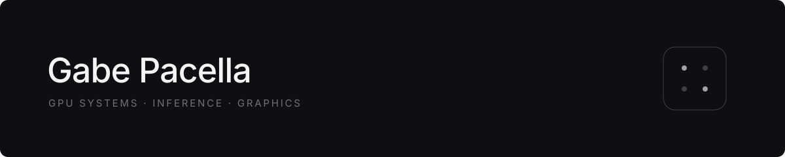

  

  GPU systems &nbsp;·&nbsp; inference &nbsp;·&nbsp; graphics

  <a href="https://gpack2.github.io/">Website</a> &nbsp;·&nbsp;
  <a href="https://www.linkedin.com/in/gabriel-pacella/">LinkedIn</a>

---

I'm Gabe, an undergraduate at Carnegie Mellon University interested in building fast, useful software close to the hardware.

### Selected work

- **[inference-engine](https://github.com/gpack2/inference-engine)** — Qwen2.5 inference with KV caching and CPU, MPS, and CUDA validation.
- **[in-game-GPU-overlay](https://github.com/gpack2/in-game-GPU-overlay)** — Real-time hardware telemetry rendered directly over game frames.
- **[GPU-kernel-practice](https://github.com/gpack2/GPU-kernel-practice)** — CUDA kernels and notes from learning GPU programming.
- **[packpdf](https://github.com/gpack2/packpdf)** — A fast, lightweight PDF editor built for schoolwork.

